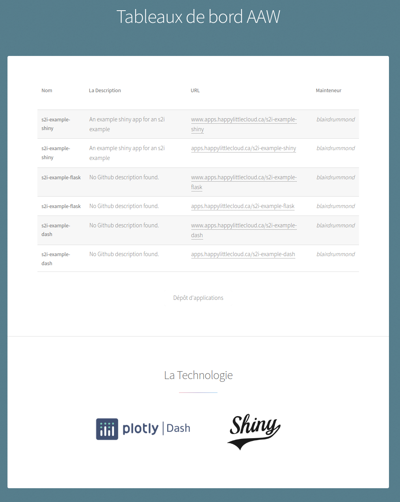

# service-dashboard

A little golang app that scrapes its namespace for Kubernetes ingress-rules, and presents them as a dashboard.

It supports French internationalization, and caches the api calls for 1 minute.

[Example](apps.happylittlecloud.ca)

